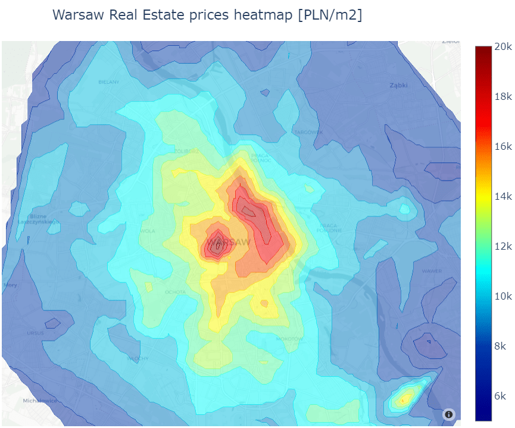

 

  

# Real Estate Pricing in Warsaw

<!-- Add buttons here -->

[![LinkedIn][linkedin-shield]][linkedin-url]
[![Related articles][medium-shield]][medium-url]

<!-- TABLE OF CONTENTS -->
## Table of Contents

* [About the Project](#about-the-project)
* [Built With](#built-with)
* [Key Takeaways](#key-takeaways)

<!-- ABOUT THE PROJECT -->
## About The Project

The aim of this project is to combine webscraping practice with analysis of Real Estate prices in Warsaw. Creating an accurate price predictioin model requires combining multiple data sources such as RE offers from otodom, google drivetime data from googlemaps or data about reaturants and places of culture. 

The project combines over 25k Real Estate offers from Warsaw, drivetime and commute data from over 600 points and several thousands of restaurants to capture unique features of each property and location. Joining multiple data sources allowed to create a precise price benchmarking model and compare unique features of different parts of Warsaw. 

Topics covered in this projects are the foundation on my current project of Web App helping to find best location to buy/rent a glat based on your lifestyle and preferences. 

#### The project consists of 3 parts:

- PART1) Focuses on webscraping, extracting data from json, extracting category and multicategory data to one-hot vectors suitable for models and data cleaning. One of most interesting elements of this notebook is imputation of misslabeled district names with use of nearest neighbour voting. 

- PART2) Deals with geospatial data vizualization.  I decided to experiment with geojson heatmaps to create immersive maps. Using heatmaps to visualize prices or drivetime is much easier to read than any other methods based on scatter plots or grid choropleth maps.  

- PART3) Experiments with building several models to model predict and benchmark prices. Thorough error analysis based on spatial characteristics allows to balance model tuning with data enrichment as after initial training some of the errors were geogrphy specific, wchich means that our data did not capture some of the important location features. Adding additional sources helped to reduce error much more than any improvement of the models could.  

## Built With

* BeutifulSoup
* GeojsonCountour
* Plotly
* SciKit-learn
* TensorFlow/Keras

## Key takeaways

Extracting Real Estate data proved to be much more challenging than working with car offers as flats have many more features. Their features are also structured in a more complex way with majority of features saved as multilabel data. Use of Sklearn pipeline with MultiLabelBinazer helped to solve this issue and make data ready for modelling. On the other hand, the fact that Real Estate offers are always linked to some location by coordinates makes combining multiple data sources much easier. 

Using geojson contour to create custom choropleth heatmaps allowed to make geospatial visuzalization much more attractive. Working with multiple data sources allows to visualize specific characteristics of different parts of Warsaw. This created some interesting insights, which I would not have found otherwise despite living in Warsaw for two decades. 

Creating price benchmarking models using 50 top features showed that distance and drivetime to center are the most important sources of information about property price - this is logical as these featuers best describe "good location", which is the key driver of real estate prices. Other important features include a discount for East Bank of Vistula river and Bialoleka district where prices are much lower than in other geographies. Floor number is the most important property specific feature with garage and lift also being quite important.

Suprisingly two features describing local reaturants made it into top 10 predictors - restaurants popularity (no. of reviews) and restaurant price level. This can be seen as "The chicken or the egg" causality dilemma - probably popular districts drive restaurant popularity and not the other way round but despite local restaurants being the effect of popular locations not the other way around, their data can be still used to model popular and fancy locations effect on price. 

[linkedin-shield]: https://img.shields.io/badge/-LinkedIn-black.svg?style=flat-square&logo=linkedin&colorB=555
[linkedin-url]: https://www.linkedin.com/in/jan-majewski-132907104/

[medium-shield]: https://img.shields.io/badge/-Articles-black.svg?style=flat-square&
[medium-url]: https://towardsdatascience.com/visualizing-spatial-data-with-geojson-heatmaps-1fbe2063ab86

