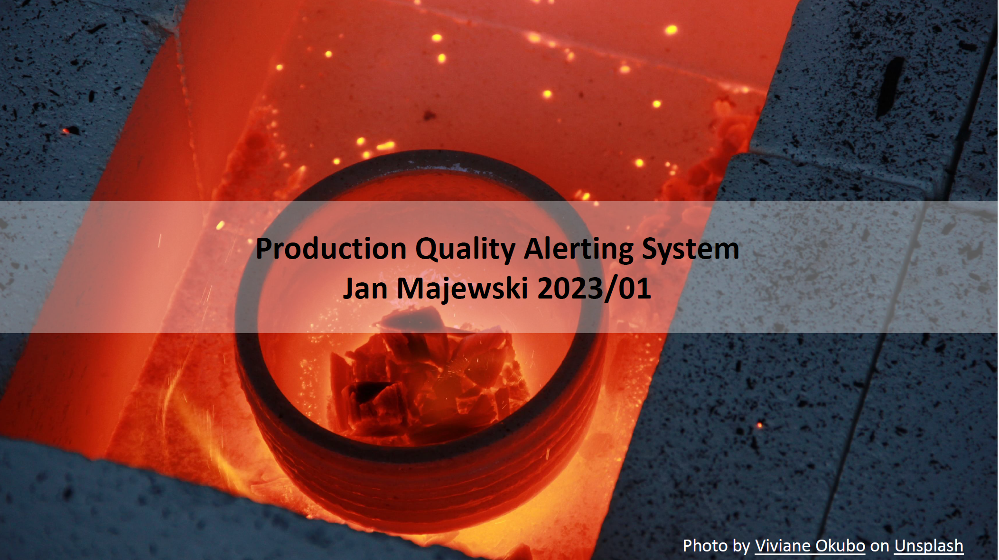

 

  

# Production Quality Alerting System

<!-- Add buttons here -->

[![LinkedIn][linkedin-shield]][linkedin-url]
[![Related articles][medium-shield]][medium-url]

<!-- TABLE OF CONTENTS -->
## Table of Contents

* [About the Project](#about-the-project)
* [Built With](#built-with)
* [Key Takeaways](#key-takeaways)

<!-- ABOUT THE PROJECT -->
## About The Project

Experiment with failure forecasting in an industrial environment based on Kaggle dataset and problem statement:
https://www.kaggle.com/datasets/podsyp/production-quality

## Built With

* XGBoost
* TensorFlow/Keras
* Plotly

## Key takeaways
* Fixing bad data quality for one of the sensors might be the best way to improve prediction quality
* Even initial experiment provided valuable insights with single point of the production line being the key predictor for future failures
* Difference in granularity of X and y data proved to be the biggest data wrangling challenge
* RNNs provided better results than initial XGBoost model
* XGBoost with HPO should also provide better results in the future

[linkedin-shield]: https://img.shields.io/badge/-LinkedIn-black.svg?style=flat-square&logo=linkedin&colorB=555
[linkedin-url]: https://www.linkedin.com/in/jan-majewski-132907104/

